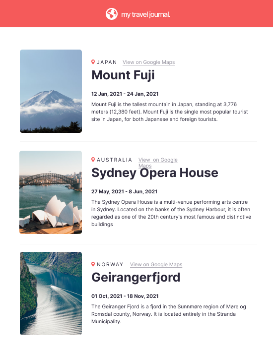

# Travel journey

## Requirements

- Data array in a separate .js file
- Title, Location, Google maps link, start date, end date ,description, image URL
- Use .map() and props
- Styled & polished

Color

## Color

grey : #918E9B

black: #2B283A

rose: #F55A5A

white : #FFFFFF

## Font

Inter : [https://fonts.google.com/specimen/Inter](https://fonts.google.com/specimen/Inter)

H1: Medium

H2, Date : Bold

P : Regular

## Sketch

## Online

[https://scrimba-travel-journal.vercel.app/](https://scrimba-travel-journal.vercel.app/)
